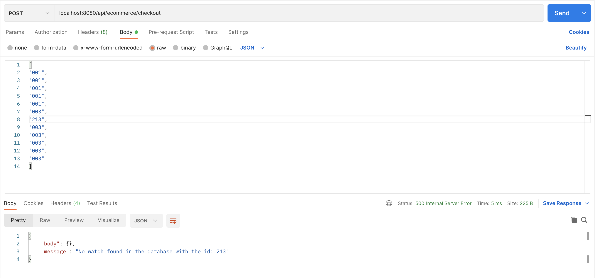

**Ecommerce Application**
----
REST API to calculate the total price of all the watches in the cart after applying discounts, if any.

**API**
----
|Endpoint| Method | Body | Response|
|--------|--------|------------------|---------|
|_/api/ecommerce/checkout_ | `POST` | List of ids of watches | Total final price of the watches or an error|

**Setting up locally**
----
Navigate to the project repository from terminal. Generate the JAR
```shell
mvn clean install
```
Import the project repository in your IDE and click `Run as`->`Java Application` OR run the project from terminal.
```shell
java -jar target/<jar_file_name>.jar
```

**Examples**

* **Sample request Success Response:**


* **Sample Error Response:**
